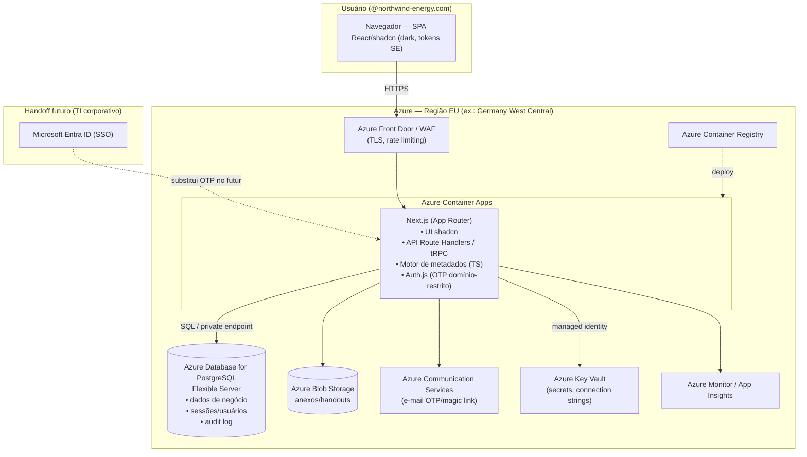

# EDQMS — Proposta de Arquitetura para o MVP

**Division Governance Portal · Northwind Energy**
Versão 1.0 · 29/07/2026 · Documento de arquitetura (base para desenvolvimento do MVP a partir do protótipo)

---

## 1. Sumário executivo

O protótipo do EDQMS já é um artefato de engenharia muito acima da média de um "mockup": não é uma coleção de telas estáticas, mas um **motor orientado a metadados**. Um único arquivo de especificação (`data/datamodel.json`) descreve todos os módulos, tabelas, colunas, cards de KPI, gráficos (reports), formulários em drawer, filtros e subitens; o runtime (`model.js` + `resolve.js` + `queries.js`) lê essa especificação e **renderiza cada tela genericamente**, resolvendo chaves estrangeiras, rollups, valores espelhados (mirror) e cálculos por uma "escada de joins" validada contra os dados. Esse desenho é o maior ativo do projeto e deve ser **preservado** na migração para o MVP.

A recomendação central é: reconstruir a camada de apresentação em **Next.js + React + TypeScript + shadcn/ui + Tailwind**, **portar o motor de metadados para TypeScript no servidor**, substituir os dados em memória por **PostgreSQL gerenciado**, e trocar o login fixo por **autenticação por e-mail (OTP/magic link) restrita ao domínio `@northwind-energy.com`**. A hospedagem do MVP será na **Azure** — escolha alinhada ao ecossistema Microsoft da Northwind Energy e que facilita o handoff futuro para o time de TI corporativo (integração com Entra ID, redes privadas, Key Vault).

Três decisões foram confirmadas com o solicitante e orientam todo o documento: **(1)** nuvem-alvo **Azure**; **(2)** autenticação por **e-mail OTP/magic link** com allowlist de domínio (independente do TI até que o SSO corporativo esteja disponível); **(3)** **preservar o motor metadata-driven**, reimplementando o renderizador genérico em React/shadcn em vez de codificar cada tela manualmente.

> **Advertência de governança (importante).** O sistema foi desenvolvido para a Northwind Energy, mas o TI corporativo ainda não definiu as restrições de arquitetura, rede e segurança. Enquanto isso não ocorrer, o MVP em nuvem pública deve operar **exclusivamente com dados sintéticos/mockados** — não carregue dados reais de clientes, fábricas ou pessoas em ambiente não homologado. A arquitetura abaixo já é desenhada para o handoff (identidade gerenciada, endpoints privados, segregação de ambientes), de modo que a transição para a nuvem corporativa exija reconfiguração, não reescrita.

---

## 2. Avaliação do protótipo atual

### 2.1 O que existe hoje

O protótipo é uma SPA em **JavaScript vanilla (ES modules), sem build e sem framework**. O `index.html` carrega tokens CSS do nance Design System, o ECharts e o `js/app.js`, que faz o bootstrap: exige login, carrega o `datamodel.json` (a especificação) e o `mockup_data_prototype.json` (os dados), monta a navegação e renderiza a aba ativa. Toda a estrutura de tela é **derivada da especificação em tempo de execução**.

O domínio é rico e fortemente relacional. Há sete módulos de negócio — Organization, Portfolio, CRM, Talent, Operation, Workspace e Control — além de um dashboard **Overview** montado automaticamente a partir de cards e reports marcados com `overview-display: true`. As entidades (Forecasts, Tickets, Tasks, Workflows, Activities, Product Scopes, Competences, Roles, People, Jobs, entre dezenas de outras) relacionam-se por FKs, rollups, chaves compostas e caminhos de dois saltos.

### 2.2 Componentes do motor

| Arquivo | Responsabilidade | Papel no MVP |
|---|---|---|
| `data/datamodel.json` | Especificação canônica da UI (módulos → tabelas → atributos, cards, reports, forms, filtros, subitens). | **Fonte da verdade.** Mantém-se como especificação viva; passa a gerar também o schema do banco. |
| `js/model.js` | Carrega a especificação; parser tolerante do mini-DSL das `rule` (FK/rollup/mirror/computed/enum); ordenação do sidebar; parsing de subitens. | Portar para TS como pacote `engine` (server-side). |
| `js/resolve.js` | Resolução de valores em runtime: display de FK, filhos de rollup, computeds, escada de joins validada contra os dados. | Portar para TS; passa a rodar no servidor (resolução por consulta ao Postgres). |
| `js/queries.js` | Mapa declarativo de queries: cada card/report em prosa vira uma função nomeada (`<Tabela>::<Report-X/Card R-C>`). | Portar para TS como serviço de analytics/queries no servidor. |
| `js/forms.js` (44 KB) | Drawers de New/Edit, formulários em cascata (Task Templates) e wizard de 4 passos (Jobs), com selects dependentes e "criar novo" aninhado. | Reconstruir em React/shadcn (a lógica de cascata/dependência migra; a renderização é nova). |
| `js/table.js` · `charts.js` · `filters.js` · `cards.js` · `reports.js` · `overview.js` | Componentes genéricos de UI (tabela com sort/search/subitens, gráficos ECharts, drawer de filtros estilo Microsoft Lists, cards, reports, overview). | Reconstruir sobre shadcn `DataTable`, shadcn charts (Recharts) e blocos `dashboard-01`/`sidebar-07`. |
| `tools/test_resolve.mjs` · `test_queries.mjs` · `test_jobs.mjs` | Testes que asseguram que resolução e queries batem com o dataset. | **Ativo crítico** — portar para Vitest e manter verdes na migração (rede de segurança da paridade de comportamento). |

### 2.3 Lacunas que o MVP precisa fechar

Três lacunas são intrínsecas ao fato de ser um protótipo e definem trabalho estrutural (não apenas cosmético):

Primeiro, **persistência**: os dados vivem em memória e são reiniciados a cada reload (`data.js`). O MVP precisa de um banco real, transações, e create/update/delete duráveis.

Segundo, **autenticação e autorização**: o protótipo não tem login (o gate de demonstração foi removido quando o projeto virou open source — nada sensível vive no cliente). O MVP precisa de autenticação real por e-mail com restrição de domínio e, na sequência, controle de acesso por papel (RBAC).

Terceiro, **computação no cliente**: hoje todas as resoluções, joins, cards e reports são calculados no navegador sobre o dataset inteiro (585 KB de JSON carregados de uma vez). Isso não escala nem é seguro (todo o dado trafega para o cliente). No MVP, essa computação migra para o **servidor**, que devolve apenas o que a tela precisa e o que o usuário pode ver.

Os backlogs de UI existentes (`PROTOTYPE_REVIEW.md` e `prototype_v1-review.md`) — adoção dos blocos shadcn `dashboard-01`, `login-01`, `sidebar-07`, `DataTable`; modo escuro por padrão; linha de somatório (Σ); filtros estilo Microsoft Lists; correções de exibição de nomes vs. IDs; bug de renderização/resize dos reports — permanecem válidos e serão absorvidos naturalmente ao reconstruir a UI em shadcn. O bug de resize dos gráficos, em particular, desaparece ao usar o `ResponsiveContainer` do Recharts.

---

## 3. Arquitetura-alvo do MVP

### 3.1 Princípios

A arquitetura segue quatro princípios. **Especificação como fonte da verdade**: o `datamodel.json` continua descrevendo o sistema e passa a alimentar tanto a UI quanto a geração do schema do banco. **Computação no servidor**: o motor de metadados roda server-side; o cliente é uma casca de renderização. **Um único deployable no MVP**: full-stack Next.js reduz a superfície operacional enquanto o time é pequeno. **Pronto para handoff**: identidade gerenciada, secrets em cofre, rede segregável e infraestrutura como código, para que o TI corporativo assuma sem reescrever.

### 3.2 Diagrama de componentes



### 3.3 Stack recomendada

| Camada | Escolha | Justificativa |
|---|---|---|
| Frontend | **Next.js (App Router) + React + TypeScript + Tailwind + shadcn/ui** | shadcn é o requisito explícito de UI; ele é construído sobre React + Tailwind. Next.js dá SSR/route handlers e permite um único deployable full-stack. |
| Componentes de UI | **shadcn/ui** (blocos `dashboard-01`, `sidebar-07`, `login-01`, `DataTable`, `Drawer`, `Combobox`, `Field`) | Mapeiam 1:1 com os requisitos já anotados no `PROTOTYPE_REVIEW.md`. Tokens do nance Design System aplicados via tema Tailwind (modo escuro padrão). |
| Gráficos | **shadcn charts (Recharts)**; ECharts como exceção para gráficos muito específicos | Consistência visual com shadcn e correção do bug de resize (ResponsiveContainer). O mapa de queries (`queries.js`) é agnóstico à biblioteca de chart. |
| Motor de metadados | **Pacote TypeScript `@edqms/engine`** portado de `model/resolve/queries` | Preserva o maior ativo do protótipo; roda no servidor. |
| API | **Route Handlers do Next.js com tRPC** (type-safe) — expondo também REST/OpenAPI para portabilidade | tRPC acelera o desenvolvimento com tipagem ponta-a-ponta; a fachada REST facilita handoff e integrações futuras. |
| Persistência | **PostgreSQL** (Azure Database for PostgreSQL Flexible Server) + **Prisma** (ou Drizzle) como ORM | Relacional casa com o domínio fortemente relacional; JSONB cobre campos multivalorados/arrays. Prisma gera migrações e tipos. |
| Autenticação | **Auth.js (NextAuth v5)** — provider de e-mail (magic link/OTP) + allowlist de domínio no callback `signIn` | Independente do TI; troca-se o provider por Entra ID no futuro sem reescrever a aplicação. |
| E-mail | **Azure Communication Services** (ou SendGrid/Resend) | Entrega dos códigos/links de verificação. |
| Infra | **Azure Container Apps + PostgreSQL Flexible + Blob + Key Vault + Container Registry + Front Door/WAF** | Full-stack Next.js em contêiner; escalável, com endpoints privados e identidade gerenciada. |
| IaC & CI/CD | **Bicep (ou Terraform) + GitHub Actions** | Reprodutibilidade e handoff; build da imagem → ACR → deploy no Container Apps. |
| Testes | **Vitest** (unidade/motor) + **Playwright** (E2E) | Porta `test_resolve/queries/jobs`; garante paridade de comportamento e regressões de UI. |

### 3.4 Organização do repositório (monorepo)

Recomenda-se um monorepo com **pnpm workspaces + Turborepo**, separando o motor (reutilizável e testável isoladamente) da aplicação:

```
edqms/
├─ apps/
│  └─ web/                # Next.js (App Router): UI shadcn + route handlers/tRPC + Auth.js
├─ packages/
│  ├─ engine/             # motor de metadados em TS (model, resolve, queries) + testes Vitest
│  ├─ ui/                 # componentes shadcn compartilhados + tema/tokens nance
│  └─ db/                 # schema Prisma, migrações, seed a partir do mockup
├─ spec/
│  └─ datamodel.json      # a especificação canônica (fonte da verdade)
├─ infra/                 # Bicep/Terraform (Azure) + pipelines
└─ turbo.json / pnpm-workspace.yaml
```

---

## 4. Autenticação e autorização

### 4.1 Requisito e desenho

O requisito é claro: **somente e-mails `@northwind-energy.com`** podem acessar, com validação por e-mail. O desenho recomendado usa **Auth.js (NextAuth v5)** com um provider de e-mail configurado para **magic link ou OTP de 6 dígitos**. O fluxo é: o usuário informa o e-mail → o backend **rejeita qualquer domínio diferente de `@northwind-energy.com`** antes de enviar qualquer mensagem → um link/código assinado e de curta validade é enviado via Azure Communication Services → ao confirmar, cria-se uma sessão (cookie httpOnly/secure). A restrição de domínio é imposta **no servidor**, no callback `signIn`, e reforçada por uma allowlist opcional de usuários aprovados em tabela própria (útil para revogar acessos sem depender do TI).

```ts
// exemplo conceitual (Auth.js v5) — validação de domínio server-side
callbacks: {
  async signIn({ user }) {
    const email = (user.email ?? "").toLowerCase();
    return email.endsWith("@northwind-energy.com"); // bloqueia o resto
  },
}
```

A tela de login reutiliza o bloco shadcn **login-01** (já previsto no backlog), agora ligada ao fluxo real de e-mail em vez das credenciais fixas do protótipo.

### 4.2 Autorização (RBAC) e caminho para o SSO

Para o MVP, um RBAC simples baseado em papéis (por exemplo, Quality Manager, Planner, Viewer) já cobre a necessidade — o domínio já modela People/Roles/Functions, o que dá base natural para mapear permissões. As sessões e usuários ficam no próprio Postgres (adapter do Auth.js). Quando o TI liberar o **Entra ID**, a migração é de baixo atrito: troca-se o provider de e-mail pelo provider de OIDC/Entra, mantendo callbacks, RBAC e o resto da aplicação intactos. Desenhar assim desde já evita retrabalho no handoff.

---

## 5. Dados e persistência

### 5.1 Da memória para o Postgres

O protótipo carrega `mockup_data_prototype.json` para a memória e indexa por PK (`data.js`). No MVP, cada entidade da especificação vira uma **tabela relacional** no Postgres. Campos multivalorados e arrays (por exemplo, `scopeID[]`, chaves compostas) usam **JSONB** ou tabelas de associação, conforme a cardinalidade. Um princípio importante: **campos derivados não são armazenados**. Rollups, mirrors e computeds continuam sendo calculados em tempo de consulta pelo motor — exatamente como o protótipo faz no cliente, só que agora no servidor. Isso mantém o `datamodel.json` como fonte única da verdade e evita dados derivados inconsistentes.

### 5.2 Geração do schema a partir da especificação

Como a especificação já cataloga cada atributo com `type`, `rule` e `constraints`, recomenda-se um **gerador** que leia `datamodel.json` e produza o schema Prisma (ou DDL) para os campos **armazenados** (não-derivados), preservando PKs e FKs declaradas. O seed inicial vem do `mockup_data_prototype.json`. Assim, uma mudança na especificação propaga-se para banco e UI de forma controlada, e a "escada de joins" validada contra dados (um diferencial do protótipo) continua funcionando porque as relações reais existem no banco.

### 5.3 Analytics (cards e reports)

O mapa de queries (`queries.js`) traduz cada regra em prosa numa função. No MVP essas funções passam a rodar no servidor, sobre o Postgres — inicialmente reaproveitando a lógica portada (em memória, por entidade) e, onde houver volume, evoluindo para **SQL/views** dedicadas. Como cada função já tem teste correspondente, a paridade de resultados é verificável a cada passo.

---

## 6. Infraestrutura Azure

O núcleo do MVP é um contêiner Next.js rodando em **Azure Container Apps**, com **Azure Database for PostgreSQL Flexible Server** para dados, sessões e log de auditoria, **Azure Blob Storage** para anexos/handouts, **Azure Communication Services** para os e-mails de verificação, **Azure Key Vault** para secrets e connection strings (acessado via **managed identity**, sem segredos no código), **Azure Container Registry** para as imagens e **Azure Front Door + WAF** na borda (TLS, rate limiting, proteção básica). Observabilidade via **Azure Monitor / Application Insights**.

Recomenda-se região na **União Europeia** (por exemplo, Germany West Central), coerente com a base da Northwind Energy e com requisitos de residência de dados/GDPR — mesmo operando só com dados sintéticos, o hábito de residência correta simplifica o handoff. O banco deve usar **private endpoint** (sem exposição pública), e a aplicação acessá-lo pela rede virtual. Ambientes separados (`dev`/`staging`/`prod`) desde o início.

Alternativa mais enxuta, se a prioridade for velocidade máxima de MVP: **Azure App Service (Web App for Containers)** no lugar do Container Apps — menos flexível em escala, porém com menos peças. A recomendação permanece Container Apps pela trajetória de crescimento.

Toda a infra é descrita como código (**Bicep** ou Terraform) e publicada por **GitHub Actions**: build da imagem → push no ACR → deploy no Container Apps, com migrações Prisma aplicadas no pipeline.

---

## 7. Migração do protótipo para o MVP — mapeamento direto

| Protótipo (hoje) | MVP (alvo) |
|---|---|
| SPA vanilla ES modules, sem build | Next.js + React + TypeScript, build/CI |
| Tokens CSS do nance Design System | Tema Tailwind com os mesmos tokens; modo escuro padrão |
| ECharts | shadcn charts (Recharts); ECharts como exceção |
| Sem autenticação (acesso aberto) | Auth.js: e-mail OTP/magic link, domínio `@northwind-energy.com` |
| `data.js` em memória (JSON) | PostgreSQL (Prisma) + seed do mockup |
| `model/resolve/queries` no cliente | Pacote `@edqms/engine` em TS no servidor |
| `forms.js` (drawers, cascata, wizard) | Drawers shadcn; lógica de cascata/dependência preservada |
| `table/filters/cards/reports` genéricos | `DataTable` shadcn, filtros estilo Microsoft Lists, cards/reports server-driven |
| `datamodel.json` como spec de render | `datamodel.json` como spec de render **e** geração de schema |
| `tools/test_*.mjs` | Vitest (motor) + Playwright (E2E), mantidos verdes |

---

## 8. Roadmap por fases

**Fase 0 — Fundação (infra + esqueleto).** Provisionar Azure via IaC (Container Apps, Postgres, Key Vault, ACR, Comm Services), configurar CI/CD, criar o monorepo, subir o Next.js com o gate de autenticação por e-mail restrito ao domínio e a tela de login (bloco `login-01`). Entregável: aplicação vazia, autenticada, publicada em `dev`.

**Fase 1 — Motor + leitura.** Portar `model/resolve/queries` para o pacote `@edqms/engine` (com os testes verdes), gerar o schema do banco a partir do `datamodel.json`, semear com o mockup, e reconstruir a experiência **somente-leitura**: sidebar (`sidebar-07`), abas/dashboards (`dashboard-01`), `DataTable` com subitens, cards e reports server-driven. Entregável: navegação e visualização completas sobre dados persistidos.

**Fase 2 — Escrita.** Formulários de New/Edit em drawer shadcn com validação, persistência real (create/update/delete), linha de somatório (Σ), filtros de tabela estilo Microsoft Lists e "criar novo item" aninhado nos selects de rollup. Entregável: CRUD completo nas entidades editáveis.

**Fase 3 — Fluxos específicos + Overview.** Formulários bespoke (cascata Task Templates: Event → Process → Workflow → Activity; wizard de Jobs em 4 passos), dashboard Overview com botões "Details", filtros de report em drawer, e Settings (modo escuro; configurador de calendário pode ficar como stub conforme o próprio backlog permite). Entregável: paridade funcional com o protótipo.

**Fase 4 — Endurecimento + prontidão para handoff.** RBAC por papel, log de auditoria, testes E2E (Playwright), revisão de segurança, documentação de operação e pacote de handoff para o TI (incluindo o caminho de troca do OTP por Entra ID e a migração para a nuvem corporativa). Entregável: MVP pronto para avaliação do TI e para receber dados reais após homologação.

As fases são sequenciais em dependência, mas 2 e 3 podem sobrepor-se parcialmente quando houver mais de um desenvolvedor.

---

## 9. Riscos e mitigação

O principal risco é de **governança**: rodar em nuvem pública sem aval do TI corporativo. Mitiga-se operando apenas com dados sintéticos até a homologação e desenhando já para o handoff (identidade gerenciada, endpoints privados, IaC, região EU). O segundo risco é a **complexidade do motor**: a escada de joins e o parser tolerante de regras são sofisticados; a mitigação é portar com os testes existentes como rede de segurança e evoluir por fatias verificáveis. O terceiro é o **acoplamento à qualidade da especificação**: como o `datamodel.json` dirige banco e UI, inconsistências nele propagam; a mitigação é o gerador de schema validar a especificação e os testes de resolução/queries cobrirem o dataset. Por fim, há o risco de **e-mail transacional** (entregabilidade dos OTPs): mitiga-se com Azure Communication Services (ou provedor equivalente) e monitoração de bounce.

---

## 10. Próximos passos sugeridos

Recomendo, na ordem: validar este documento e ajustar as três decisões-chave se necessário; provisionar a Fase 0 (infra + gate de auth por domínio) para destravar o desenvolvimento; e escrever o gerador `datamodel.json → schema` cedo, pois ele é o eixo que mantém a especificação como fonte da verdade. Posso, a partir daqui, detalhar qualquer camada — por exemplo, o esquema Prisma inicial derivado do `datamodel.json`, o design da API (tRPC/REST), os templates de IaC em Bicep, ou o desenho detalhado do fluxo de autenticação.
