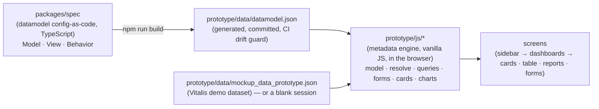

# Architecture Overview

**nance.it** is a **metadata-driven** application. Instead of each screen being hand-coded, a **specification** (the *datamodel*) describes the system and an **engine** interprets it and renders it generically. (For what nance.it *is* — a knowledge-driven governance platform whose quality-management engine is EDQMS — see [[Home]].) Understanding this flow is the prerequisite to contributing productively.

## The flow in one sentence

**Spec → artifact → engine → screens.** The specification says *what* exists (entities, fields, relations, forms, cards, reports); it is compiled to `datamodel.json`; the engine resolves derived values, joins and queries and draws every module, table, form and chart from it. Adding a screen is a change to the spec, not new UI code.

## Today — the MVP

- **Spec** (`packages/spec`) — the only source of the datamodel. Three layers: **Model** (entities, fields, relations as typed objects), **View** (forms via `formFor`, widgets, table keys, cards/reports as data), **Behavior** (`check` cascades and `field-rule` option filters as objects). Validated at build time (the *build gate*). See [[Working with the Datamodel]].
- **Artifact** (`datamodel.json`) — generated and committed; CI rebuilds it and fails on drift. Three consumers read it: the engine's parsers, `validate_mockup.py`'s own regexes, and the engine test battery.
- **Engine** (`prototype/js`) — runs **in the browser**, on the whole dataset. `model.js` parses rules (`parseRule`) and builds the catalog; `resolve.js` resolves FK displays, mirrors, rollups and computed values (with generous fallbacks); `queries.js` hand-maps card and report rules; `forms.js` builds spec-driven forms with cascades. **No build step** — plain ES modules served statically.
- **Data** — the demo dataset is seeded (`prototype/tools/seed/`), evolved by deterministic `migrate_*.py` scripts and checked by `validate_mockup.py`. Blank mode starts empty; sessions live in `localStorage` and export/import as JSON *snapshots* stamped with `schemaVersion`. See [[Data and Migration Pipeline]].
- **Hosting** — GitHub Pages: the stakeholder Guide (MkDocs) at the root, the app under `/app/`, blank mode under `/app/mvp/` (`deploy_pages.sh`).

## Principles (already true today)

**Specification as the source of truth.** Screens, forms and derivations come from the spec; the JSON is output. Contributors change TypeScript, never the JSON.

**Derive, don't repeat.** An FK field renders as a select from its target; a numeric one joins the Σ row; a form declares only its exceptions. In the spec this is `formFor` and `defaultWidgetFor`.

**Relations as objects.** `Relation` in the spec is exactly what the engine's `parseRule` produces; the round trip is proven by test over every attribute, so the spec and the engine cannot drift.

**The battery is the oracle.** 84 engine proofs + the validator run in CI on every change to `prototype/` or `packages/spec/`.

## Tomorrow — the v1 target (decided, not built)

| Layer | Technology | ADR |
|---|---|---|
| Renderer | Vue 3 (Composition API, TS) + shadcn-vue + Tailwind — the nance design tokens | ADR-0001 |
| API | Node + Express (REST `/api/v1`, OpenAPI); the engine moves **server-side** | ADR-0001 |
| Engine / Spec | TypeScript, framework-agnostic; the same `packages/spec` | ADR-0001, ADR-0002 |
| Database | PostgreSQL + Drizzle, schema generated from the Model layer | ADR-0001 |
| Authentication | Pluggable — email OTP/magic link by default; each deployment configures its own | ADR-0001 |
| Data migration | Python ETL, idempotent, from the JSON snapshots the MVP produces | ADR-0003 |

What changes for the engine: today it runs in the browser over the full dataset; in v1 it runs on the API and the client only renders. What does **not** change: the spec, the Model/View/Behavior layers, and the "derive, don't repeat" rule. The Behavior layer currently compiles to the engine's text grammar; executable functions (`check: (f) => …`) arrive with the TS engine (see the implementation note in ADR-0002).

## Going deeper

- How to edit the specification: [[Working with the Datamodel]]
- How data is seeded, migrated and snapshotted: [[Data and Migration Pipeline]]
- The engine and its rule grammar in depth: `prototype/DATAMODEL_GUIDE.md`, `prototype/README.md`
- The decisions and their rationale: `docs/adr/` in the repository.
