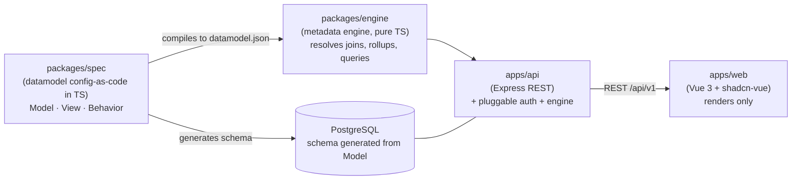

# Architecture Overview

**nance.it** is a **metadata-driven** application. Instead of each screen being hand-coded, a **specification** describes the system and an **engine** interprets it and renders it generically. (For what nance.it *is* — a knowledge-driven governance platform whose quality-management engine is EDQMS — see [[Home]].) Understanding this flow is the prerequisite to contributing productively.

## The flow in one sentence

**Spec → Engine → (API + Renderer).** The specification (the *datamodel*) says *what* exists; the engine resolves derived values, joins, and queries; the API delivers what the screen needs; the renderer (Vue) draws it. No domain logic is duplicated on the client.

## Principles

**Specification as the source of truth.** `datamodel.json` is no longer hand-written; it is *compiled* from the specification in TypeScript (see [[Working with the Datamodel]] and ADR-0002). The same spec feeds the UI, the database schema, and migration validation.

**Server-side computation.** The engine runs on the backend. The client receives only the data it needs and that the user is allowed to see — no downloading the whole database into the browser (as the prototype did).

**Framework-agnostic core.** `packages/engine` and `packages/spec` are pure TypeScript, with no Vue, Express, or Postgres. This keeps the cost of any framework change low and lets the engine be tested in isolation.

**Derive, don't repeat.** Most of the presentation is *derived* from the Model (an FK field becomes a select; a numeric field joins the Σ sum). Screens declare only exceptions. This is what avoids editing N instances when a parameter changes.

## Stack (summary)

| Layer | Technology | ADR |
|---|---|---|
| Renderer | Vue 3 (Composition API, TS) + shadcn-vue + Tailwind | ADR-0001 |
| API | Node + Express (REST `/api/v1`, OpenAPI) | ADR-0001 |
| Engine / Spec | TypeScript (framework-agnostic) | ADR-0002 |
| Database | PostgreSQL + Drizzle (schema generated from the spec) | ADR-0001 |
| Authentication | Pluggable — email OTP/magic link by default; each deployment configures its own | ADR-0001 |
| Data/ETL | Python | ADR-0003 |

## Going deeper

- How to edit the specification: [[Working with the Datamodel]]
- How data enters the system: [[Data and Migration Pipeline]]
- The decisions and their rationale: `docs/adr/` in the repository.
