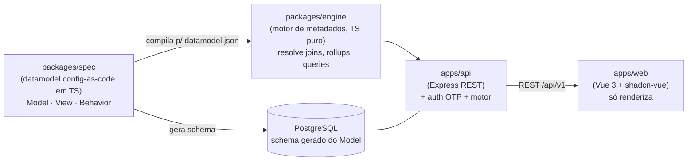

# Architecture Overview

O EDQMS é uma aplicação **orientada a metadados**. Em vez de cada tela ser codificada à mão, uma **especificação** descreve o sistema e um **motor** a interpreta e renderiza genericamente. Entender esse fluxo é o pré-requisito para contribuir de forma produtiva.

## O fluxo em uma frase

**Spec → Motor → (API + Renderer).** A especificação (o *datamodel*) diz *o que* existe; o motor resolve valores derivados, joins e queries; a API entrega o que a tela precisa; o renderer (Vue) desenha. Nenhuma lógica de domínio é duplicada no cliente.

## Princípios

**Especificação como fonte da verdade.** O `datamodel.json` deixa de ser escrito à mão e passa a ser *compilado* a partir da spec em TypeScript (ver [[Working with the Datamodel]] e ADR-0002). A mesma spec alimenta a UI, o schema do banco e a validação da migração.

**Computação no servidor.** O motor roda no backend. O cliente recebe apenas os dados que precisa e que o usuário pode ver — nada de baixar a base inteira para o navegador (como fazia o protótipo).

**Núcleo agnóstico de framework.** `packages/engine` e `packages/spec` são TypeScript puro, sem Vue, Express ou Postgres. Isso mantém o custo de qualquer troca de framework baixo e permite testar o motor isoladamente.

**Derivar, não repetir.** A maior parte da apresentação é *deduzida* do Model (um campo FK vira um select; um numérico entra na soma Σ). As telas declaram só exceções. É o que evita ter de editar N instâncias ao mudar um parâmetro.

## Stack (resumo)

| Camada | Tecnologia | ADR |
|---|---|---|
| Renderer | Vue 3 (Composition API, TS) + shadcn-vue + Tailwind | ADR-0001 |
| API | Node + Express (REST `/api/v1`, OpenAPI) | ADR-0001 |
| Motor / Spec | TypeScript (agnóstico de framework) | ADR-0002 |
| Banco | PostgreSQL + Drizzle (schema gerado da spec) | ADR-0001 |
| Autenticação | E-mail OTP/magic link, domínio `@northwind-energy.com` | ADR-0001 |
| Dados/ETL | Python | ADR-0003 |

## Para se aprofundar

- Como editar a especificação: [[Working with the Datamodel]]
- Como os dados entram no sistema: [[Data and Migration Pipeline]]
- As decisões e seus porquês: `docs/adr/` no repositório.
